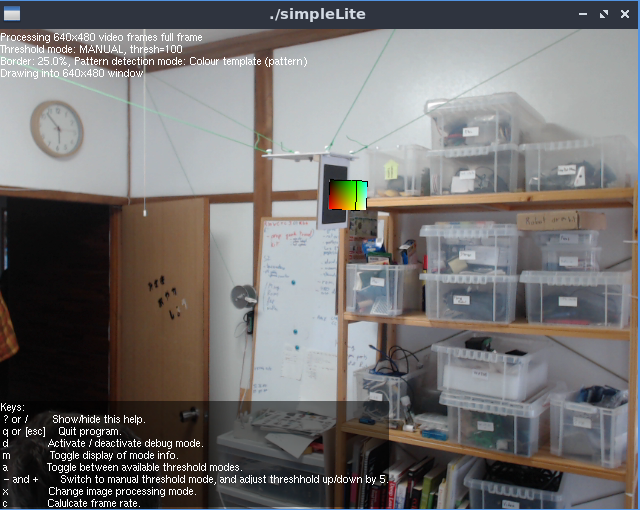

This dataset was made using a v1 of the fae bot, suspended in Yves' office. Picture of the setup for reference:


File format
-----------

The file format is straighforward:

lines start either with 'm' to indicate motor commands or 'p' to indicate a detected pose.
If it starts with m the format is 
```
m TS M1 M2 M3 M4
```
TS: Timestamp (in seconds since the program started)
M1 : speed of motor 1 (Lower means faster. The unit is "cycles between pulses, see below")
M2 : speed of motor 2
M3 : speed of motor 3
M4 : speed of motor 4 

If it starts with p the format is 
```
p TS Qs Qx Qy Qz Px Py Pz
```
TS: Timestamp (in seconds since the program started)
Q is the (Qx,Qy,Qz) quaternion with scalar/w value of Qs
P is the position of the center of the AR code in a frame relative to the camera


Cycles between pulses
---------------------

The fae bot v1 uses stepper motors to roll/unroll wires. Such a motor moves by small increments, triggered by pulses sent regularly. Pulses sent at a higher frequency mean the motor will rotate faster. The way the control software works is by waiting a given number of program cycles between pulses to modulate the speed. The number in the `m` lines indicates the number of cycles.

Directory structure
-------------------

random/

contains a series of moves where the speed of the motors were randomly set for 0.5 seconds. 

manual/

contains a series of moves where the motor speeds were set manually by an operator who tried to minimize slack on the wires. They are a series of movements where only one motor at a time moves.